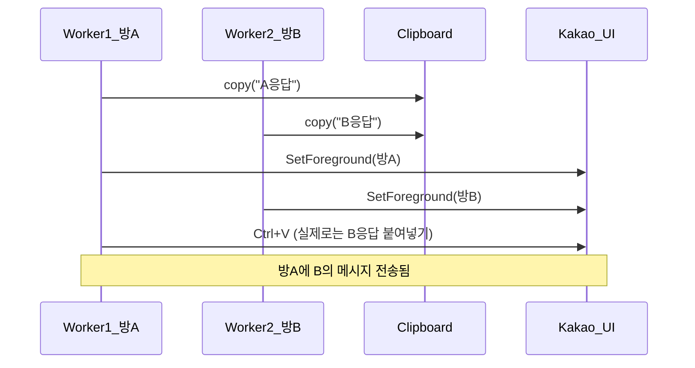

# 스레드 잠금 처리 검토 및 보강

**요약**: 명령어를 스레드로 실행할 경우, Lock 없이 여러 스레드가 동시에 `send()`를 호출하면 클립보드·포커스 경쟁으로 메시지가 잘못된 방에 가거나 내용이 뒤섞일 수 있다. send 직렬화용 전역 Lock 도입을 권장한다.

**현재 소스 상태**: 명령어 스레드는 롤백된 상태라 **모든 명령이 동기 처리**되고, `send()`는 **메인 스레드에서만** 호출된다 (process_message_queue 311행, check_new_commands 849행). 따라서 지금은 동시 전송 경쟁이 없다. 아래 내용은 **명령어 스레드를 재도입할 때** 적용할 검토 및 권장안이다.

> 스레드 재도입 구현 계획은 [스레드_재도입_구현_계획.md](스레드_재도입_구현_계획.md) 참조.

---

## 현재 상태: 잠금 처리되어 있지 않음

- **Lock/RLock 사용처**: [Lib/chat_process.py](Lib/chat_process.py)에는 `threading.Lock`이 없음. [Lib/log_monitor.py](Lib/log_monitor.py)에는 모니터 스레드만 있고 send 직렬화용 Lock은 사용하지 않음.
- **공유 자원 (스레드 재도입 시)**: 워커 스레드와 메인 스레드가 **동시에** 다음을 사용하게 됨.
  - **클립보드**: `pyperclip.copy(text)` (전역) — sendtext 474행
  - **키보드/포커스**: `SetForceGroundWindow`, `keybd_event` (전역) — 여러 행
  - **인스턴스 속성**: `self.chatroomHwnd`, `self.chatroom_name` (워커는 읽기만 함)

## 위험 시나리오

- 두 채팅방에서 스레드 명령이 거의 동시에 끝나면, 한 스레드가 복사한 내용이 다른 스레드에 의해 덮어쓰이고, 포커스도 엇갈리면서 **잘못된 방에 메시지 전송** 가능.
- `last_index`는 메인 스레드만 갱신하므로 race 없음. 문제는 **전송(send) 직렬화 부재**이다.

## 권장 방안: send 직렬화 Lock

- **목표**: 한 시점에 하나의 스레드만 `send()` (및 그 내부의 `sendtext`/`send_image`)를 실행하도록 함.
- **위치**: [Lib/chat_process.py](Lib/chat_process.py)
- **구현 요지**:
  1. **모듈 레벨 Lock** 1개 추가 (예: `_send_lock = threading.Lock()`).
  2. **`send()`** 메서드 진입 시 `with _send_lock:` 로 감싸기.  
     - `send()` 내부에서 호출하는 `sendtext`, `send_image`는 그대로 두고, `send()` 한 곳만 잠금하면 됨.
  3. **`process_message_queue()`**에서 호출하는 `self.send()`(311행)도 동일한 Lock을 타므로, 메인 스레드와 워커 스레드가 동시에 전송하지 않음.

이렇게 하면 클립보드·포커스 경쟁이 제거되고, 메시지 순서는 "Lock을 잡은 순서"대로 전송된다.

## 대안 (참고)

- **전송 전용 큐 + 단일 전송 스레드**: 워커는 `(chatroom_name, resultString, result_type)`만 큐에 넣고, 별도 스레드 하나가 큐에서 꺼내 해당 `ChatProcess`의 `send()` 호출. 구조는 더 복잡하지만 전송 순서를 한 곳에서 관리할 수 있음. 당장은 Lock 방식이 변경 범위가 작고 충분함.

## 요약 표

| 항목 | 현재 | 권장 |
|------|------|------|
| send 직렬화 | 없음 (경쟁 가능) | `threading.Lock()`으로 `send()` 진입 직렬화 |
| last_index | 메인만 갱신 (안전) | 변경 없음 |
| chatroomHwnd 등 | 워커는 읽기만 | 변경 없음 (필요 시 추후 Lock 검토) |

결론: **스레드 잠금은 현재 잘 되어 있지 않으며**, `send()`에 대한 **전역 Lock 1개**를 도입하는 것이 필요하고 충분하다.

---

## 2차 검토: send() 호출 경로 및 기타 공유 자원

**send() 호출처 (전부 정리)**  
- [Lib/chat_process.py](Lib/chat_process.py) **311행**: `process_message_queue()` (메인 스레드)  
- **849행**: `check_new_commands()` 동기 명령 처리 (메인 스레드)  
- (스레드 재도입 시) `_run_command_in_thread()` (워커 스레드)

**메시지 큐**  
- `add_message_to_queue()`는 [Lib/log_monitor.py](Lib/log_monitor.py) **328행** (`_send_kakao_message` 내)에서 로그 모니터 스레드가 호출 → `queue.Queue.put()`.  
- `process_message_queue()`는 메인만 호출 → `queue.get()` 후 `send()`.  
- `queue.Queue`는 스레드 안전하므로 put/get 경쟁은 없음. 문제는 **실제 전송**이 메인(큐 처리)과 워커(명령 처리)에서 동시에 일어날 수 있다는 점뿐.

**chatroomHwnd 갱신**  
- 메인만 `run()` 내부에서 `chatroomHwnd`를 갱신(**252–260**, **362/365**, **375/377**, **418–424**행).  
- 워커는 `send()` 시점에 `self.chatroomHwnd`를 **읽기만** 함. 동시 쓰기 없음.  
- 창이 닫혀 핸들이 무효해진 뒤 메인이 아직 갱신하지 않은 경우 등은 별도 이슈(창 생명주기)이며, Lock으로 해결할 문제는 아님.

---

## 3차 검토: 전역 Lock 필요성, 데드락/재진입

**전역 Lock이어야 하는 이유**  
- 클립보드(`pyperclip.copy`)와 포커스/키보드(`SetForegroundWindow`, `keybd_event`)는 **프로세스 전역** 자원.  
- 채팅방별 Lock만 쓰면 "방 A 전송"과 "방 B 전송"이 동시에 진행되어, 서로 다른 방인데도 클립보드·포커스가 섞일 수 있음.  
- 따라서 **프로세스 단위 전역 Lock 1개**로 모든 `send()` 진입을 직렬화해야 함.

**데드락**  
- Lock은 `send()` 진입 시 한 번만 획득. 다른 Lock과의 교차 획득 없음 → 데드락 가능성 없음.

**재진입(같은 스레드가 Lock 두 번)**  
- `chat_func`(각 명령 핸들러)는 `send()`를 호출하지 않고 `(resultString, result_type)`만 반환.  
- `send()`는 호출자(메인 또는 `_run_command_in_thread`)가 한 번만 호출.  
- 따라서 `send()` 안에서 다시 `send()`가 호출되는 경로 없음. `threading.Lock()`(비재진입)으로 충분.

---

## 최종 정리

- **직렬화 필요 구간**: `send()` (및 그 내부 `sendtext`/`send_image`)만 전역 Lock으로 보호하면 됨.  
- **추가 Lock 불필요**: `last_index`, `message_queue`, `chatroomHwnd` 읽기/쓰기 패턴상 별도 Lock 없이도 됨.  
- **구현**: `chat_process` 모듈에 `_send_lock = threading.Lock()` 추가 후, `send()` 본문 전체를 `with _send_lock:` 로 감싸기.
