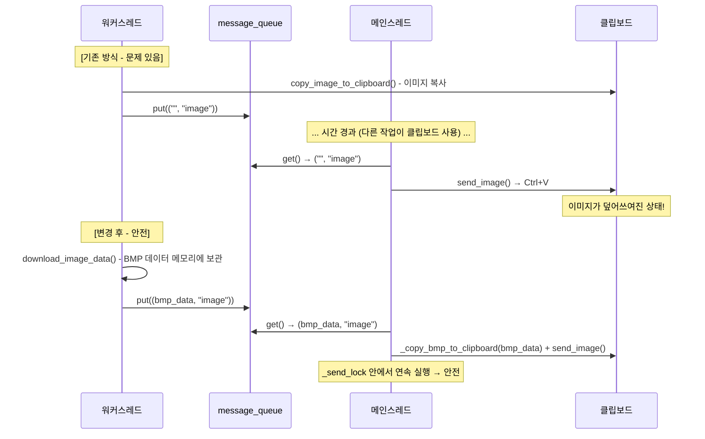

# 명령어 처리 스레드 재도입 구현 계획

> 관련 문서: [스레드_잠금_검토_및_보강.md](스레드_잠금_검토_및_보강.md)

> **선행 조건 (2026-07-10 추가)**: 본 계획은 [instagram_기능_복구_작업계획.md](instagram_기능_복구_작업계획.md) **이후에** 진행한다.
> 그 계획이 `GetData`/`send()` 계약을 이미 다음과 같이 바꿨다: 이미지 핸들러는 **DIB 바이트**
> (BMP 인코딩에서 14바이트 BITMAPFILEHEADER를 제거한 것)를 payload로 반환하고, 클립보드
> 복사는 전송자(`send_image`)가 전송 직전에 수행하며 `CF_DIB` 형식 확인 + 실패 시 텍스트
> 폴백까지 책임진다. 본 문서의 `_copy_bmp_to_clipboard(text)`가 받는 인자도 동일한 DIB
> 바이트다 — BMP 파일 전체 바이트가 아니다. 이 계약 덕에 본 문서가 다루는
> "지금 복사, 나중에 붙여넣기" TOCTOU는 이미 제거돼 있고, 스레드화 시에는 `_send_lock`
> 보호 하에 복사→확인→붙여넣기를 원자적으로 묶기만 하면 된다.

---

## 1. 현재 문제점: 메인 루프 블로킹

### 현재 동기 실행 구조

```
main.py while True (0.1초 간격)
  └─ chat.run()                          ← 채팅방마다 순차 실행
       ├─ copy_cheat()                   ← 채팅 로그 복사 (300-500ms)
       ├─ check_new_commands(df)
       │    └─ chat_func() → send()      ← 여기서 블로킹 발생!
       └─ process_message_queue()
```

[Lib/chat_process.py](../Lib/chat_process.py) `check_new_commands()` (841-852행)에서 `chat_func()`를 동기 호출하고, 그 결과로 `send()`까지 동기 실행한다. 느린 명령어가 실행되면 메인 루프 전체가 멈추므로 **다른 채팅방의 메시지 감지가 지연**되고, 빠른 명령어 응답도 느려진다.

### 명령어별 응답 시간 분석

| 명령어 | 핸들러 | API 호출 | 예상 응답시간 |
|--------|--------|---------|-------------|
| `#gpt` | [Lib/gpt_api.py](../Lib/gpt_api.py) `getData()` (90행) → `ask_gpt()` (99행) | OpenAI API (`openai.chat.completions.create`, 119-157행) | **2-10초** |
| `#유툽` | [Lib/youtube.py](../Lib/youtube.py) `GetData()` (206행) | Google YouTube API v3 (`search().list`, `videos().list`) | **2-5초** |
| YouTube URL | [Lib/youtube_summary.py](../Lib/youtube_summary.py) `GetData()` (97행) | YouTube Transcript API + Gemini API (`generate_content`, 65-91행) | **3-15초** |
| Instagram URL | [Lib/insta.py](../Lib/insta.py) `GetData()` (123행) | Instaloader API + requests 이미지 다운로드 (76행, 100행) | **2-10초** |
| `#?`, `#command` | [Lib/dataManager.py](../Lib/dataManager.py) `GetData()` (77행) | 없음 (문자열 조합) | < 10ms |
| `#all` | [Lib/every_mention.py](../Lib/every_mention.py) `GetData()` (73행) | 없음 (pyautogui UI 조작) | < 1초 |
| `#방인원` | [Lib/json_data_manager.py](../Lib/json_data_manager.py) (78행) | 없음 (JSON 파일 I/O) | < 10ms |
| `#모델변경` | [Lib/gpt_api.py](../Lib/gpt_api.py) (210행) | 없음 (설정값 변경) | < 10ms |
| `#모델확인` | [Lib/gpt_api.py](../Lib/gpt_api.py) (232행) | 없음 (JSON 조회) | < 10ms |
| `#사용량확인` | [Lib/gpt_api.py](../Lib/gpt_api.py) (242행) | 없음 (JSON 읽기) | < 10ms |
| `[카카오맵]` | [Lib/convert_naver_map.py](../Lib/convert_naver_map.py) (89행) | 없음 (정규식 파싱) | < 10ms |
| `#로그모니터*` | [Lib/log_monitor.py](../Lib/log_monitor.py) (417-467행) | 없음 (플래그/스레드 제어) | < 10ms |

### 블로킹 영향 예시

채팅방 2개(A, B)를 모니터링 중일 때:
- 방 A에서 `#gpt 긴 질문` 실행 → 10초 블로킹
- 그 동안 방 B에서 `#?` (즉시 응답 가능) 요청 → 10초 후에야 응답

---

## 2. 아키텍처 설계

### 목표

느린 명령어(네트워크 호출)를 워커 스레드로 분리하여 메인 루프 블로킹을 제거하고, `send()` 직렬화를 위한 전역 Lock을 도입한다.

### 전체 흐름도

```
메인 루프 (main.py while True, 0.1초 간격)
  └─ chat.run()
       ├─ check_new_commands()
       │    ├─ 빠른 명령어 (#?, #command, #all, #방인원, ...)
       │    │    → 동기 실행: chat_func() → send() (기존과 동일)
       │    │
       │    └─ 느린 명령어 (#gpt, #유툽, YouTube URL, Instagram URL)
       │         → _executor.submit(_run_slow_command, ...)
       │            워커 스레드에서:
       │              1) chat_func() 실행 (네트워크 IO)
       │              2) message_queue.put(결과)
       │
       ├─ _cleanup_futures()          ← 완료된 Future 정리
       │
       └─ process_message_queue()     ← 큐에서 꺼내 send() (with _send_lock)
```

### 명령어 분류

```python
# 느린 명령어 (네트워크 호출 포함) → 워커 스레드로 분리
SLOW_COMMANDS = {
    '#gpt', '#유툽',
    'https://www.youtube.com/', 'https://youtu.be/', 'https://youtube.com/',
    'https://www.instagram.com/',
}

# UI 직접 조작 명령어 → _send_lock 보호 하에 동기 실행
UI_DIRECT_COMMANDS = {'#all'}
```

**`#all`을 별도 분류하는 이유**: [Lib/every_mention.py](../Lib/every_mention.py) `GetData()`는 `pyautogui`로 키보드/포커스를 직접 조작한다. `send()`를 호출하지 않고 `(None, "none")`을 반환하지만, 느린 명령어의 `send()`가 동시에 실행되면 포커스가 충돌한다. 따라서 `_send_lock` 보호 하에 실행해야 한다.

### ThreadPoolExecutor 선택 이유

- 개별 `threading.Thread`보다 동시 실행 수를 `max_workers`로 자연스럽게 제한
- 한 채팅방당 `max_workers=2`: 3번째 이후 명령은 풀 내부 큐에서 대기 (유실 없음)
- Future 객체로 워커 상태 및 예외 추적 가능

---

## 3. 변경 대상 파일별 상세

### 3.1. [Lib/chat_process.py](../Lib/chat_process.py) — 핵심 변경

#### (a) import 및 전역 변수 추가 (행 10 이후)

```python
import threading
from concurrent.futures import ThreadPoolExecutor

SLOW_COMMANDS = {
    '#gpt', '#유툽',
    'https://www.youtube.com/', 'https://youtu.be/', 'https://youtube.com/',
    'https://www.instagram.com/',
}

UI_DIRECT_COMMANDS = {'#all'}

# send() 직렬화용 전역 Lock (프로세스 전체에서 하나)
_send_lock = threading.Lock()
```

#### (b) `__init__()` 수정 (행 44 이후)

```python
self._executor = ThreadPoolExecutor(max_workers=2,
                                     thread_name_prefix=f"cmd-{chatroom_name}")
self._pending_futures = []
```

#### (c) `send()` 수정 (행 451-461)

`with _send_lock:`으로 감싸고, image 타입 시 BMP 데이터를 클립보드에 복사:

```python
def send(self, text, type="text"):
    with _send_lock:
        if type == "text":
            self.sendtext(self.chatroom_name, self.chatroomHwnd, text)
        elif type == "image":
            self._copy_bmp_to_clipboard(text)
            self.send_image(self.chatroomHwnd, self.chatroom_name)
```

#### (d) 새 메서드 3개 추가

**`_copy_bmp_to_clipboard()`** — Lock 보호 하에 BMP 데이터를 클립보드에 복사:

```python
def _copy_bmp_to_clipboard(self, bmp_data):
    try:
        win32clipboard.OpenClipboard()
        win32clipboard.EmptyClipboard()
        win32clipboard.SetClipboardData(win32con.CF_DIB, bmp_data)
        win32clipboard.CloseClipboard()
    except Exception as e:
        self.CustomPrint(f"❌ 클립보드 이미지 복사 실패: {e}")
        try:
            win32clipboard.CloseClipboard()
        except:
            pass
```

**`_run_slow_command()`** — 워커 스레드에서 실행, 결과를 큐에 넣음:

```python
def _run_slow_command(self, chat_command, chat_func, chatroom_name, message):
    try:
        self.CustomPrint(f"⏳ [스레드] 느린 명령어 시작: {chat_command}")
        resultString, result_type = chat_func(chatroom_name, chat_command, message)
        if result_type is not None:
            self.message_queue.put((resultString, result_type), block=False)
            self.CustomPrint(f"✅ [스레드] 결과 큐에 추가: {chat_command} -> [{result_type}]")
    except Exception as e:
        error_msg = f"❌ 명령어 오류 ({chat_command}): {e}"
        self.CustomPrint(f"[스레드] {error_msg}")
        self.message_queue.put((error_msg, "text"), block=False)
```

**`_cleanup_futures()`** — 완료된 Future 정리 및 예외 로깅:

```python
def _cleanup_futures(self):
    still_pending = []
    for f in self._pending_futures:
        if f.done():
            exc = f.exception()
            if exc:
                self.CustomPrint(f"❌ [스레드] 미처리 예외: {exc}")
        else:
            still_pending.append(f)
    self._pending_futures = still_pending
```

#### (e) `check_new_commands()` 수정 (행 841-852)

느린/빠른 명령어 분기 + `break` 추가:

```python
for chat_command, desc, chat_func in dataManager.chat_command_Map:
    if chat_command in msg:
        message = self.split_command(chat_command, msg)
        self.CustomPrint(f"🎯 명령어 감지: {chat_command} (line_idx: {line_idx})")

        if chat_command in SLOW_COMMANDS:
            # 느린 명령어: 워커 스레드로 분리
            future = self._executor.submit(
                self._run_slow_command,
                chat_command, chat_func, self.chatroom_name, message
            )
            self._pending_futures.append(future)
            self.CustomPrint(f"⏳ [비동기] 느린 명령어 스레드 제출: {chat_command}")
        else:
            # 빠른 명령어: 동기 실행
            try:
                if chat_command in UI_DIRECT_COMMANDS:
                    with _send_lock:
                        resultString, result_type = chat_func(
                            self.chatroom_name, chat_command, message
                        )
                else:
                    resultString, result_type = chat_func(
                        self.chatroom_name, chat_command, message
                    )
                if result_type is not None:
                    self.send(resultString, result_type)
                self.CustomPrint(f"✅ 명령어 처리 완료: {self.chatroom_name} - {msg[:30]}... - [{result_type}]")
            except Exception as e:
                self.CustomPrint(f"❌ 명령어 처리 중 오류: {str(e)}")

        break  # 하나의 메시지에 하나의 명령어만 처리
```

**`break` 추가 이유**: YouTube URL 3개 패턴(`https://www.youtube.com/`, `https://youtube.com/`, `https://youtu.be/`)이 모두 등록되어 있어 중복 매칭이 발생할 수 있다.

#### (f) `run()` 수정 (행 281-290)

`_cleanup_futures()` 호출 추가:

```python
result = self.check_new_commands(df)

if len(result) > 0:
    for cmd_key, func_ptr in result:
        self.CustomPrint(cmd_key)
elif Helper.is_debug_mode():
    self.CustomPrint("신규 채팅이 없습니다.", saveLog=False)

self._cleanup_futures()       # 완료된 Future 정리
self.process_message_queue()  # 큐 메시지 전송
```

#### (g) `process_message_queue()` 로깅 수정 (행 308)

이미지 데이터(bytes)가 큐에 들어올 수 있으므로 타입 체크 필요:

```python
# 기존
self.CustomPrint(f"📤 큐에서 메시지 전송: {message[:30]}...")

# 변경
log_msg = message[:30] if isinstance(message, str) else "[이미지 데이터]"
self.CustomPrint(f"📤 큐에서 메시지 전송: {log_msg}...")
```

### 3.2. [Lib/insta.py](../Lib/insta.py) — 이미지 처리 리팩토링

#### 핵심 문제

현재 `GetData()` (123행)가 `copy_image_to_clipboard()` (130행)를 호출하여 클립보드에 이미지를 직접 복사한 뒤 `("", "image")`를 반환한다. 워커 스레드에서 실행하면 `send_image()` 시점까지 시간 차가 발생하여 **클립보드가 다른 작업으로 덮어쓰여질 수 있다**.

#### 해결: BMP 데이터를 반환하고, 클립보드 복사는 send()에서 수행

`download_image_data()` 함수를 분리:

```python
def download_image_data(image_url):
    """이미지 URL에서 BMP 데이터를 다운로드 (클립보드 미사용, 스레드 안전)"""
    try:
        response = requests.get(image_url, timeout=10)
        if response.status_code == 200:
            image = Image.open(BytesIO(response.content))
            output = BytesIO()
            image.convert("RGB").save(output, "BMP")
            data = output.getvalue()[14:]  # BMP 헤더 제거
            output.close()
            Helper.CustomPrint("✅ 이미지 다운로드 완료.")
            return data
        else:
            Helper.CustomPrint(f"❌ 이미지 다운로드 실패 (상태 코드: {response.status_code})")
            return None
    except Exception as e:
        Helper.CustomPrint(f"❌ 이미지 다운로드 중 오류: {str(e)}")
        return None
```

`GetData()` 수정:

```python
def GetData(opentalk_name, cheate_commnad, message):
    image_url = ig_thumb(cheate_commnad + message)
    if image_url is None:
        return "Not Found Image", "text"

    Helper.CustomPrint(f"✅ Instagram Post Image URL: {image_url}")
    image_data = download_image_data(image_url)

    if image_data is None:
        return "이미지 다운로드에 실패했습니다.", "text"

    return image_data, "image"  # BMP 데이터 반환 (클립보드 복사는 send()에서)
```

`copy_image_to_clipboard()`는 `__main__` 직접 테스트용으로 유지.

### 3.3. [main.py](../main.py) — 종료 시 ThreadPoolExecutor 정리 (행 80)

```python
try:
    while True:
        for chat in chatList:
            chat.run()
        time.sleep(0.1)
except KeyboardInterrupt:
    Helper.CustomPrint("프로그램 종료 중...")
    for chat in chatList:
        if hasattr(chat, '_executor'):
            chat._executor.shutdown(wait=False)
```

---

## 4. 스레드 안전성 분석

### 공유 자원별 보호 방법

| 공유 자원 | 접근 패턴 | 보호 방법 |
|-----------|-----------|-----------|
| 클립보드 (`pyperclip.copy`, `win32clipboard`) | `sendtext` 474행, `send_image` 507-512행 | `_send_lock`으로 `send()` 직렬화 |
| 포커스 (`SetForegroundWindow`) | `sendtext` 465행, `send_image` 500행 | `_send_lock`으로 `send()` 직렬화 |
| 키보드 (`keybd_event`) | `sendtext` 478-486행, `send_image` 508-517행 | `_send_lock`으로 `send()` 직렬화 |
| `message_queue` | 워커: `put()`, 메인: `get()` | `queue.Queue` 내장 스레드 안전 |
| `last_index` | 메인만 갱신 (855-859행) | 별도 보호 불필요 |
| `chatroomHwnd` | 메인만 쓰기, 워커는 간접 읽기 | 별도 보호 불필요 |

### copy_cheat()와의 충돌이 없는 이유

[Lib/chat_process.py](../Lib/chat_process.py) `copy_cheat()` (527행)은 메인 스레드의 `run()` 내부에서 호출되며, 클립보드를 사용한다 (Ctrl+A, Ctrl+C). 그러나:

- 워커 스레드는 `send()`를 **직접 호출하지 않고** 큐에만 넣는다.
- `send()`는 메인 스레드의 `process_message_queue()`에서만 호출된다.
- 메인 스레드 실행 순서: `copy_cheat()` → `check_new_commands()` → `process_message_queue()`
- 따라서 `copy_cheat()`와 `send()`가 **동시에 실행되지 않는다**.

### insta.py 클립보드 문제 상세



---

## 5. 잠재적 위험과 대응

### 5.1. 메시지 순서 비보장

느린 명령어 A가 먼저 시작되었지만 B가 먼저 끝나면, B의 응답이 먼저 전송된다. **허용 가능한 동작**이다. 사용자 입장에서 "먼저 끝난 것이 먼저 오는 것"이 자연스럽다.

### 5.2. 동일 명령어 중복 실행

사용자가 `#gpt 질문1` 직후 `#gpt 질문2`를 보내면 두 개가 동시에 실행된다. `max_workers=2`로 제한되어 3번째부터는 풀 내부 큐에서 대기한다. **의도된 동작**.

### 5.3. gpt_api.py usage JSON 동시 접근

[Lib/gpt_api.py](../Lib/gpt_api.py) `log_api_usage()`에서 두 워커가 동시에 JSON 파일을 읽고 쓰면 내용이 손상될 수 있다. 이 데이터는 **통계 로그**이므로 간헐적 손실이 치명적이지 않다. 엄격히 하려면 `gpt_api.py`에 별도 `_usage_lock = threading.Lock()`을 추가할 수 있다.

### 5.4. 프로그램 종료 시 워커 잔존

`ThreadPoolExecutor`는 기본적으로 non-daemon 스레드를 사용하므로, 프로그램 종료 시 워커가 끝나지 않을 수 있다. `main.py`의 `shutdown(wait=False)` 호출로 해결한다.

### 5.5. 데드락 가능성

**없음**. Lock은 `send()` 진입 시 한 번만 획득하며, 다른 Lock과의 교차 획득이 없다. `chat_func`는 `send()`를 호출하지 않으므로 재진입도 없다. `threading.Lock()`(비재진입)으로 충분하다. (상세: [스레드_잠금_검토_및_보강.md](스레드_잠금_검토_및_보강.md) 3차 검토 참조)

---

## 6. 검증 방법

| # | 시나리오 | 기대 결과 |
|---|---------|-----------|
| 1 | 빠른 명령어 (`#?`, `#command`) 실행 | 기존과 동일하게 즉시 응답 |
| 2 | `#gpt 안녕` 실행 중 다른 채팅방에서 `#?` 요청 | `#?`가 블로킹 없이 즉시 응답 |
| 3 | 두 채팅방에서 동시에 `#gpt` 실행 | 각각 올바른 방에 응답 도착 |
| 4 | Instagram URL 전송 | 이미지가 올바른 방에 전송됨 |
| 5 | `#all` 실행 중 다른 스레드의 `send()` 실행 | `_send_lock`으로 간섭 차단됨 |
| 6 | 네트워크 오류 발생 (API 키 없음 등) | 에러 메시지가 해당 채팅방에 전달됨 |
| 7 | 한 채팅방에서 3개 이상 느린 명령어 연속 입력 | 3번째부터 풀 내부에서 대기 후 순차 처리 |

---

## 변경 파일 요약

| 파일 | 변경 내용 |
|------|-----------|
| [Lib/chat_process.py](../Lib/chat_process.py) | import, `SLOW_COMMANDS`, `_send_lock`, `__init__`, `send()`, `check_new_commands()`, `run()`, `process_message_queue()`, 새 메서드 3개 |
| [Lib/insta.py](../Lib/insta.py) | `download_image_data()` 분리, `GetData()` BMP 데이터 반환 |
| [main.py](../main.py) | 종료 시 `ThreadPoolExecutor.shutdown()` |
